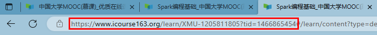
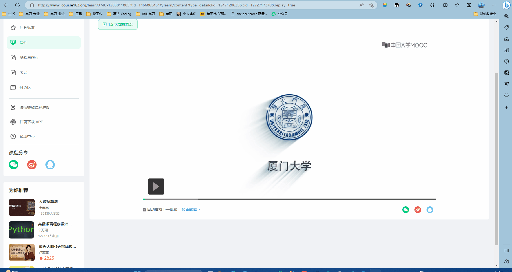

**1. 介绍**

>2023.3.24更新：支持GUI
>2023.3.23更新：支持多线程爬取

使用python写的一个MOOC爬虫工具，可以用来同时爬取参加的MOOC的视屏和字幕（如果视屏带字幕的话）。目前无法爬取已经结束的课程。

**2. 功能**

目前实现的功能如下：
* 爬MOOC的视频
* 爬MOOC的字幕
* 缓存MOOC的信息

**3. 使用方法**
1. 首先进入MOOC课程主页获取cookie和课程的url                  
   1.1 获取课程的url。这里只要复制到tid就可以了，后面的可以不要                        
    


   1.2 获取cookie。操作可以看下面的动图，获得cookie后，保存到一个文件中，命名为cookie.txt                
   


2. 命令行运行方式
   1. **命令行方式**运行下面指令：
   ```shell
   python spider.py --save-dir 保存路径 --course-url url --cookie-path cookie.txt
   # 例子：python spider.py --save-dir ./data/Spark --course-url https://www.icourse163.org/learn/XMU-1002335004?tid=1468187449 --cookie-path cookie.txt
   ```
   2. 各参数含义：
   ```
   --save-dir: 保存爬取视频的路径
   --course-url: 课程的url
   --cookie-path: 保存cookie的文件路径，可选，默认为cookie.txt
   --quality: 视频的质量，可以设置成0或1或2，可选，默认为0。0:流畅，1:标清，2:高清
   --wokers：多线程时的线程数，可选，默认是3
   ```
3. 图形界面运行方式
   1. **图形界面方式**运行下面指令
   ```shell
   python main.py
   ```